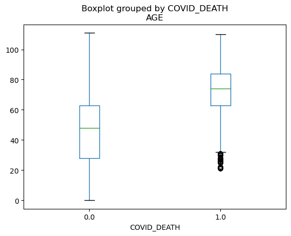
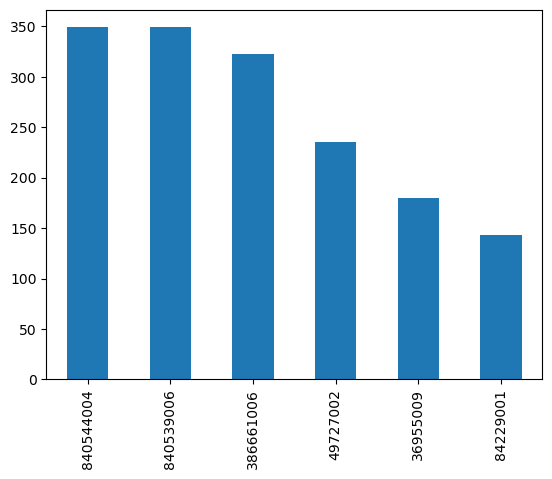
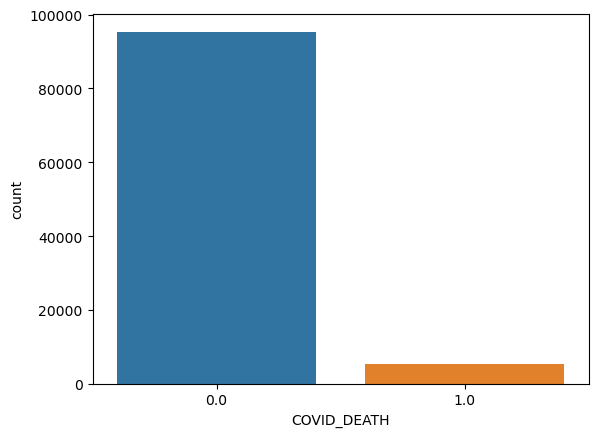

# Project Assignments 

* [Project Proposal](https://canvas.txstate.edu/courses/1993336/quizzes/6830611) 
* [Project Progress](https://canvas.txstate.edu/courses/1993336/assignments/27480554) 
* [Project Submission](https://canvas.txstate.edu/courses/1993336/assignments/27480566) 

# PROJECT FORMAT

#  Project Synthea

**Bridget Bangert & Aaron Parish** 

* Link to the Project Repository: https://git.txstate.edu/a-p789/ML4347-project-synthea

## Project Summary

<Complete for [Project Submission](https://canvas.txstate.edu/courses/1993336/assignments/27480566) assignment submission. See github.com repositories on how people shortblurb thre project e.g. REMOVE: It is a standalone section. It is written to give the reader a summary of your work. Be sure to specific, yet brief. Write this paragraph last (150-300 words)

<Fully rewrite the summary as the last step for the [Project Submission](https://canvas.txstate.edu/courses/1993336/assignments/27480566)>

## Problem Statement 

* Our goal is to use the Synthea dataset with 10k patients to predict whether or not a patient will die from COVID-19 based on their medical history. We will most of the datasets that give descriptions of a patients characteristics and medical history such as obervations, conditions, age, gender, etc.

* We are using a basic supervised machine learning model for classification if a patient dies from COVID-19 related reasons, so either logistic regression, SVM, gradient boosting/bagging.

* The data comes from Synthea, specifically the 10k patient COVID-19 dataset. The link to download the data can be found here:

https://synthea.mitre.org/downloads

* We plan to use a classifying model, possibly Logistic Regression for the base model and then a more complex one if the performance is not where we want it to be. I have been cleaning the data based on features that we do not wish to use such as payment information, insurance, location, etc. to minimize the possibility of overfitting. For cross-validation, we could potientially implement a grid search to fine-tune the parameters used in the model we choose or by simply plotting the precicion/recall curve.
    
* We hope to build a predictive model to predict whether a patient, given their characteristics and medical history, will die from COVID-19 related reasons. I hope to learn how to preprocess data in a productive manner and the process of working with unclean, noisy data to improve my intuition on building predictive models.

<Expand and Complete for [Project Submission](https://canvas.txstate.edu/courses/1993336/assignments/27480566)>

## Dataset 

* Our data consists of 16 datasets displaying information of 10k synthetic patients. We only plan on using 7 of these datasets (conditions, immunizations, observations, patients, procedures, and providers), depending on these datasets yield useful information for our task. Each of them have different shapes and features, but we really only are taking 1-3 features from each one to merge them into one large dataframe of about 10k rows.

<Expand and complete for [Project Submission](https://canvas.txstate.edu/courses/1993336/assignments/27480566)>

* What Processing Tools have you used.  Why?  Add final images from jupyter notebook. Use questions from 3.4 of the [Datasheets For Datasets](https://arxiv.org/abs/1803.09010) paper for a guide.>  

## Exploratory Data Analysis 

* The EDA graphs I have used so bar:
    * Boxplot: to visualize the disribution between a COVID-19 death vs. non-COVID-19 deaths based on age.
    * Bar charts: for various aspects (mostly to show frequencies in our data), they are attached below.

<Expand and complete for [Project Submission](https://canvas.txstate.edu/courses/1993336/assignments/27480566)>

* Describe the methods you explored (usually algorithms, or data wrangling approaches). 
  * Include images. 
* Justify methods for feature normalization selection and the modeling approach you are planning to use. 

## Data Preprocessing 

<Complete for [Project Submission](https://canvas.txstate.edu/courses/1993336/assignments/27480566)>
 
* We are reduing the dimensions of our dataframes by feature selection to relevant information based on our task. As mentioned above, we are dropping many features such as payment information, insurance, and medications. Our observations dataframe has a substancial amount of information that we may not need, so we may have to greatly reduce the dimensions. There are not many continuous features in our datasets other than observations and age. We most likely will not scale the age feature since the range is only ~100 years. For observations, we may have to use scaling since our measurements very greatly.

<Expand and complete for [Project Submission](https://canvas.txstate.edu/courses/1993336/assignments/27480566)>

## Machine Learning Approaches

* We are in the process of feature selection and merging the dataframes into one large dataframe. We then will use a supervised learning classification model then use the model's scores and a confusion matrix to evaluate its performance. If it is not to our satisfaction, then we shall use a different model or feed more data into our large dataframe. We plan on using either Logistic Regression, Gradient boosting/bagging/SVM. If the performance is not sufficient, we shall use an alternative approach to this method.

<Expand and complete for [Project Submission](https://canvas.txstate.edu/courses/1993336/assignments/27480566)>

* Describe the methods/datasets (you can have unscaled, selected, scaled version, multiple data farmes) that you ended up using for modeling. 

* Justify the selection of machine learning tools you have used
  * How they informed the next steps? 
* Make sure to include at least twp models: (1) baseline model, and (2) improvement model(s).  
   * The baseline model  is typically the simplest model that's applicable to that data problem, something we have learned in the class. 
   * Improvement model(s) are available on Kaggle challenge site, and you can research github.com and papers with code for approaches.  

## Experiments 

<Complete for the [Project Submission](https://canvas.txstate.edu/courses/1993336/assignments/27480566)>

This section should only contain final version of the experiments. Please use visualizations whenever possible.
* Describe how did you evaluate your solution 
  * What evaluation metrics did you use? 
* Describe a baseline model. 
  * How much did your model outperform the baseline?  
* Were there other models evaluated on the same dataset(s)? 
  * How did your model do in comparison to theirs? 
  * Show graphs/tables with results 
  * Present error analysis and suggestions for future improvement. 

## Conclusion
<Complete for the [Project Submission](https://canvas.txstate.edu/courses/1993336/assignments/27480566)>

* What did not work? 
* What do you think why? 
* What were approaches, tuning model parameters you have tried? 
* What features worked well and what didn't? 
* When describing methods that didn't work, make clear how they failed and any evaluation metrics you used to decide so. 
* How was that a data-driven decision? Be consise, all details can be left in .ipynb

 
 **Submission Format** 
 
1. Python code with markdown documentation, images saved in .jpg or .png format, and README.md as a project report
2. Jupyter notebook (.ipynb) that contains full markdown sections as listed above 

## Now go back and write the summary at the top of the page
